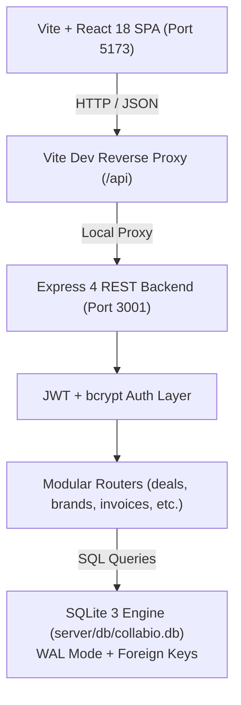

# Collabio 🤝 — Personal Deal Manager & Creator CRM

> A high-performance, developer-grade CRM and brand sponsorship operating system built for modern creators, agencies, and tech influencers.

[](https://react.dev/)
[](https://vitejs.dev/)
[](https://nodejs.org/)
[-003B57?logo=sqlite&logoColor=white)](https://sqlite.org/)
[](LICENSE)

---

## 🏗️ Architecture & System Design

Collabio is designed as a decoupled, low-latency client-server architecture with persistent local ACID-compliant SQL storage.



### Core Technology Stack
- **Frontend**: React 18, Vite 5, React Router 6, Recharts, `@hello-pangea/dnd`, Lucide Icons.
- **Backend**: Node.js, Express 4, JSON Web Tokens (JWT), `bcryptjs`.
- **Database**: Embedded **SQLite 3** (`sqlite3` driver) utilizing **WAL (Write-Ahead Logging)** mode for high concurrency and zero-latency local disk persistence.

---

## ⚡ Quick Start (Under 60 Seconds)

### 1. Prerequisites
- **Node.js**: Version `18.0.0` or higher
- **npm**: Version `9.0.0` or higher

### 2. Installation
Install root dependencies and frontend packages in one command:
```bash
npm run install:all
```

### 3. Start Development Server
Launches both the Express API and the Vite React app concurrently:
```bash
npm run dev
```

- **Frontend App**: [http://localhost:5173](http://localhost:5173)
- **Backend API**: [http://localhost:3001](http://localhost:3001)
- **System Diagnostics Endpoint**: [http://localhost:3001/api/health](http://localhost:3001/api/health)

---

## 🎯 Instant Evaluation (1-Click Demo)

No registration friction. On the login screen:
1. Click **"⚡ 1-Click Demo (Alex Rivera)"**.
2. Instantly loads a fully populated creator workspace with:
   - **Active Deals** across every stage (Outreach, Negotiating, Contract Sent, In Progress, In Review, Published, Invoiced, Paid).
   - **Realistic Brand Partners** (Notion, Sony, Epidemic Sound, Figma, Skillshare, NordVPN).
   - **Brand Contacts & Leads** with communication channels and status.
   - **Itemized Invoices** (Draft, Sent, Paid) with print/PDF preview.
   - **Service Rate Cards** and **Sponsorship Pitch Notes**.

---

## 💾 Database Architecture & Data Persistence

Collabio stores all application data in a persistent local SQLite file at:
```
server/db/collabio.db
```

### Why SQLite 3 for Collabio?
1. **Zero External Infrastructure**: No need to configure Docker, cloud clusters, or local daemon services just to run the CRM.
2. **True ACID Disk Persistence**: Unlike in-memory mock stores, your logins, custom deals, brands, and notes survive server restarts and system reboots.
3. **Write-Ahead Logging (WAL)**: Concurrent reads and writes with minimal lock contention.
4. **Relational Integrity**: Strict foreign keys with cascading deletes (`ON DELETE CASCADE`) across users, deals, brands, and invoices.

### Connecting PostgreSQL or MongoDB for Production
While SQLite is optimal for single-tenant / desktop / self-hosted creator workflows, Collabio is architected with clear SQL abstractions. See [SETUP_GUIDE.md](SETUP_GUIDE.md) for full instructions on migrating to **PostgreSQL** or **MongoDB**.

---

## 📦 Project Structure

```
Collabio/
├── client/                     # Vite React Frontend
│   ├── src/
│   │   ├── api/                # Modular REST API clients
│   │   ├── components/         # Kanban modals, Deal cards, Sidebar
│   │   ├── context/            # AuthContext, ToastContext
│   │   ├── pages/              # Dashboard, Pipeline, Brands, Invoices, Settings, etc.
│   │   ├── utils/              # Formatting helpers, currencies, date logic
│   │   ├── App.jsx             # Protected routing & navigation
│   │   └── index.css           # Premium design system tokens & utilities
│   └── vite.config.js          # Vite config with /api reverse proxy to :3001
│
├── server/                     # Express REST Backend
│   ├── db/
│   │   ├── collabio.db         # Persistent SQLite database file
│   │   └── database.js         # SQLite connection pool, schemas & seed logic
│   ├── routes/
│   │   ├── auth.js             # Register, Login, Demo login, Session check
│   │   ├── deals.js            # Deal CRUD, stage transitions, deal notes
│   │   ├── brands.js           # Brand partner directory
│   │   ├── contacts.js         # Brand partnership leads & contacts
│   │   ├── invoices.js         # Invoice generation & line items
│   │   ├── services.js         # Creator rate card & service packages
│   │   ├── notes.js            # Quick notes & negotiation scripts
│   │   ├── stats.js            # Pipeline analytics & monthly revenue
│   │   └── settings.js         # Profile preferences & JSON data export
│   └── index.js                # Express app entry & health diagnostics
│
├── README.md                   # Project overview & architecture
└── SETUP_GUIDE.md              # In-depth setup & database migration manual
```

---

## 🔌 API Endpoints Reference

| Method | Endpoint | Description | Auth Required |
|---|---|---|---|
| `GET` | `/api/health` | System health, database engine, record counts & uptime | No |
| `POST` | `/api/auth/demo` | 1-Click login as demo creator (Alex Rivera) | No |
| `POST` | `/api/auth/login` | Email/password sign-in with JWT token | No |
| `POST` | `/api/auth/register` | New creator registration | No |
| `GET` | `/api/auth/me` | Current session verification | Yes |
| `GET` | `/api/deals` | Fetch deals (supports `?status=`, `?platform=`, `?search=`) | Yes |
| `POST` | `/api/deals` | Create new deal | Yes |
| `PUT` | `/api/deals/:id` | Update deal (stage, value, deadline, status) | Yes |
| `DELETE`| `/api/deals/:id` | Delete deal | Yes |
| `GET` | `/api/stats/overview` | Pipeline value, total earned, monthly revenue | Yes |
| `GET` | `/api/invoices` | List all itemized invoices | Yes |
| `GET` | `/api/settings/export`| **Export full workspace as JSON backup** | Yes |

---

## 🛡️ License
Distributed under the MIT License. Built with ❤️ for creators and software engineers.
